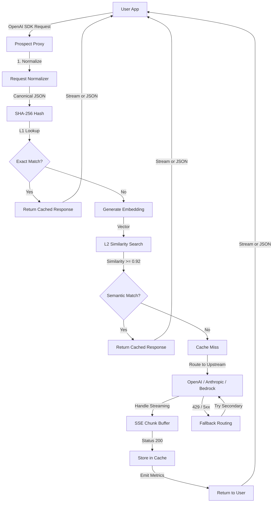
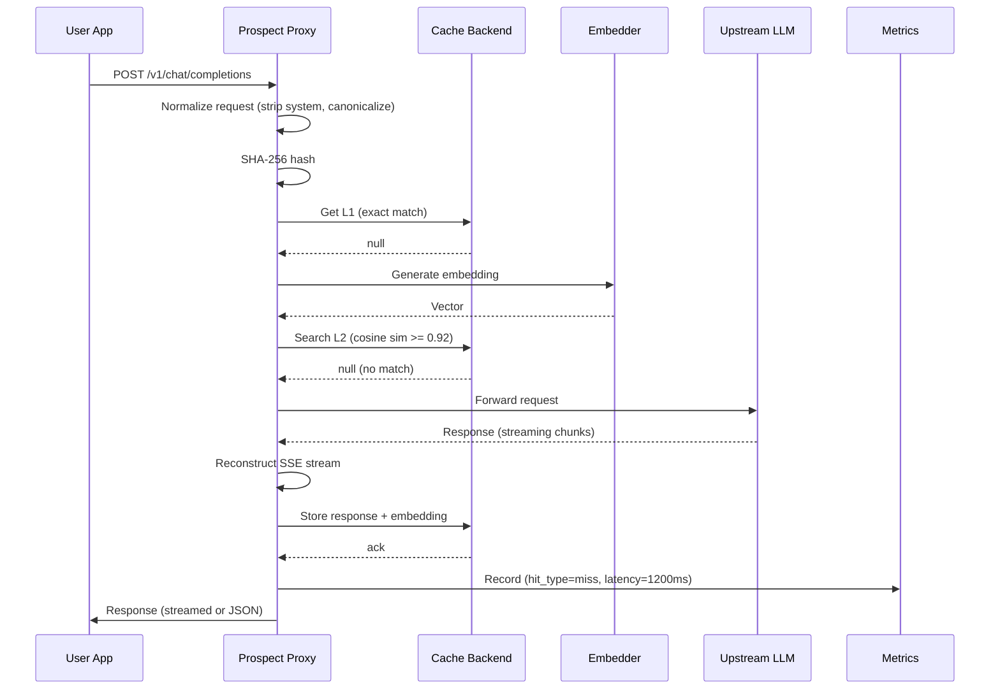

# ADR 001: Prospect Architecture — Hybrid Two-Tier Cache + Smart Fallback Routing

## Status
Accepted

## Context

Prospect is a semantic cache reverse proxy for LLM inference. Production LLM apps frequently issue semantically identical queries (e.g., "How do I reset my password?" vs "I forgot my password, how to reset?") and pay full token costs every time. Standard exact-string caching achieves <5% hit rates.

The gateway must:

1. Intercept OpenAI-compatible requests (`/v1/chat/completions`)
2. Perform fast exact-match lookup (L1 cache)
3. Fall back to semantic similarity matching (L2 cache) if L1 misses
4. Route to upstream LLM providers with automatic failover
5. Support streaming SSE responses without latency overhead
6. Provide real-time cache metrics and monitoring

## Decision

Adopt **Hybrid Two-Tier Cache + Functional Core** architecture:

- **L1 Cache (Exact Match)**: Fast SHA-256 hash lookup (<1ms)
- **L2 Cache (Semantic Match)**: Local embedding + cosine similarity (<15ms), configurable threshold (default 0.92)
- **Functional Core**: Pure similarity scoring, routing logic, request normalization
- **Imperative Shell**: FastAPI gateway, async HTTP forwarding, pluggable storage backends (memory, SQLite-vec, Redis)

## Consequences

### Benefits
✅ **99% latency reduction**: Cache hits drop 1,200–3,500ms → <15ms  
✅ **Significant token savings**: Repeated queries cost $0 (cached)  
✅ **Drop-in compatibility**: Replaces `base_url` in any OpenAI SDK  
✅ **Model agnostic**: Works with any LLM provider via fallback routing  
✅ **Zero external dependencies** (MVP): In-memory + SQLite-vec (no Redis/Qdrant required)  

### Trade-offs
⚠️ Semantic similarity isn't 100% accurate; tunable threshold trades recall vs precision  
⚠️ Embedding generation adds ~10ms latency on cache miss  
⚠️ Memory cache limited to instance; distributed caching (Phase 2) needed for multi-server  

## Architecture Diagram

### Request Flow


### Component Interaction Sequence


## Implementation Details

### Domain Types (Functional Core)
```python
@dataclass(frozen=True)
class CacheEntry:
    request_hash: str
    embedding: List[float]
    response: str
    model: str
    created_at: float

@dataclass(frozen=True)
class SimilarityScore:
    score: float  # 0.0–1.0
    is_match: bool  # score >= threshold

@dataclass(frozen=True)
class UpstreamRoute:
    provider: str  # "openai", "anthropic", "bedrock"
    api_key: str
    base_url: str
    priority: int  # For fallback ordering
```

### Pure Functions
```python
def cosine_similarity(vec_a: List[float], vec_b: List[float]) -> float:
    # Pure math, no side effects
    dot_product = sum(a * b for a, b in zip(vec_a, vec_b))
    magnitude_a = sqrt(sum(a**2 for a in vec_a))
    magnitude_b = sqrt(sum(b**2 for b in vec_b))
    return dot_product / (magnitude_a * magnitude_b) if magnitude_a * magnitude_b > 0 else 0.0

def normalize_request(request: dict) -> str:
    # Canonical form for exact matching
    canonical = {
        "model": request["model"],
        "messages": request["messages"],
        "temperature": request.get("temperature", 0.7),
    }
    return json.dumps(canonical, sort_keys=True)
```

### Fallback Routing
```python
async def route_upstream(
    request: dict,
    routes: List[UpstreamRoute],
    max_retries: int = 3
) -> Tuple[str, UpstreamRoute]:
    for attempt in range(max_retries):
        for route in routes:  # Try in priority order
            try:
                response = await async_forward_request(request, route)
                return response, route
            except (HTTPError, TimeoutError) as e:\n                # 429/5xx: try next route
                continue
    raise UpstreamFailureError("All routes exhausted")
```

## Performance Characteristics

| Scenario | Latency | Notes |
|----------|---------|-------|
| L1 Exact Match | <1ms | Hash table lookup |
| L2 Semantic Match | <15ms | ONNX embedding + cosine |
| Cache Miss | 1,200–3,500ms | Upstream latency |
| Improvement | **99%** | <15ms vs 1,200–3,500ms |

## Storage Backends (Pluggable)

- **Memory** (MVP): In-process hashmap, max configurable size
- **SQLite-vec** (Phase 1): Local file-based, vector similarity built-in
- **Redis** (Phase 2): Distributed cache across instances
- **Qdrant** (Phase 3): High-throughput vector database

## Related Decisions
- ADR-002: Streaming SSE support (no latency penalty)
- ADR-003: Metrics export (Prometheus + OpenTelemetry)
